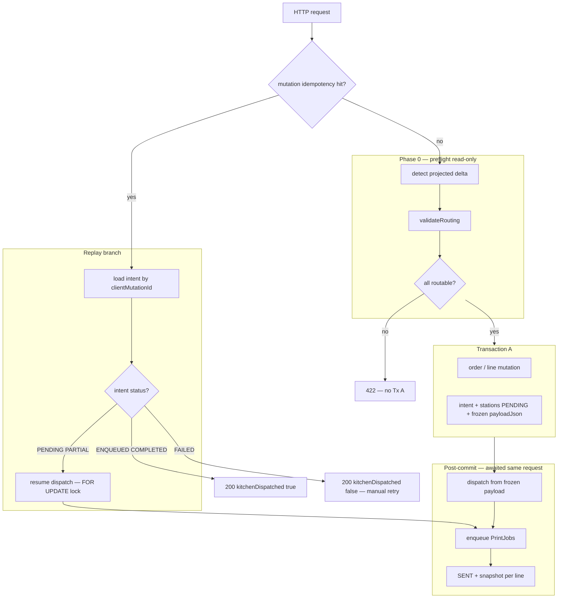
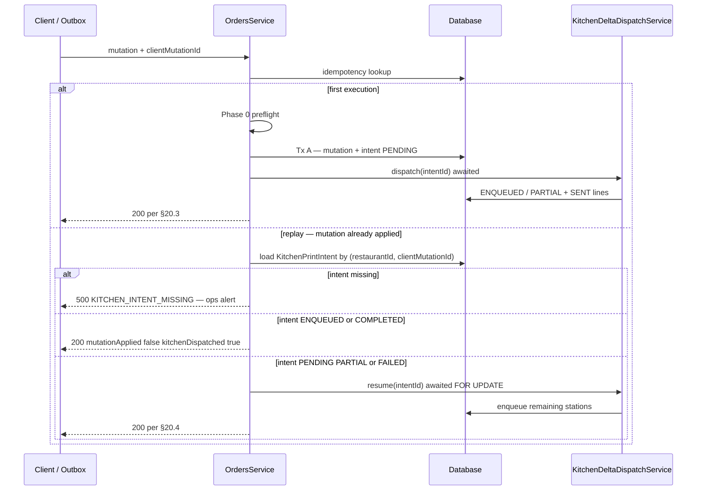
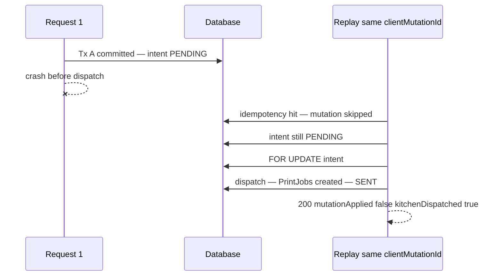

# Kitchen Delta Printing — Architecture Specification

**Status:** Approved for implementation  
**Version:** 2.1  
**Date:** 2026-06-02  
**Supersedes:** v2.0, v1.0  
**Resolves:** Implementation-readiness audit (2026-06-02)

**Related docs:**

- [kitchen-delta-printing-design-review.md](./kitchen-delta-printing-design-review.md)
- [kitchen-dispatch-exactly-once-debt.md](./kitchen-dispatch-exactly-once-debt.md)
- [conventions.md](./conventions.md)

**Prerequisites (already shipped):** `clientMutationId`, `OrderLineMutationIdempotency`, `inserted` / `applied` kitchen gates.

**Appendices (this document):**

- [Appendix A — Decision log](#appendix-a--decision-log)
- [Appendix B — Migration prerequisites](#appendix-b--migration-prerequisites)
- [Appendix C — Open questions](#appendix-c--open-questions)

---

## 1. Problem statement

Every kitchen-triggering mutation reloads **all** order lines, groups by station, and enqueues a **full ticket** per station. A second send reprints everything.

**Goal:** Print only what changed since the last successful kitchen dispatch — per line, per station — with **exactly-once enqueue semantics**, existing printer routing, and offline replay compatibility.

**Non-goals (v1):** Order merge / split / reopen / table-transfer; KDS redesign; print transport changes.

---

## 2. Current state (baseline)

Unchanged from v2.0 §2. Single active path: `OrdersService.scheduleKitchenJobsForOrder` → `PrintingService.enqueueKitchenStationJob`. `patchOrder` still triggers full reprint (removed in Phase 2).

---

## 3. Target architecture



**Single dispatcher:** `KitchenDeltaDispatchService` replaces `scheduleKitchenJobsForOrder`.

---

## 4. Normative request lifecycle

Every kitchen-triggering handler **MUST** follow these phases in order. No phase may be skipped or reordered.

### Phase 0 — Preflight (read-only, before any write)

1. Validate `clientMutationId` present (400 if missing — §20).
2. Check mutation idempotency (`Order.offlineClientMutationId` or `OrderLineMutationIdempotency`).
   - If hit → jump to **Replay path** (§9); do not run Phase 0 detect for mutation.
3. Run `createOrder` table-open guard (§10) when applicable.
4. **`detect(context)`** — build `KitchenDispatchIntent` from **projected** post-mutation state (in-memory; DB unchanged).
5. **`validateRouting(intent)`** — resolve station for every delta line (§11).
   - If any unrouted → **422** immediately; **no Transaction A** (§11.4).
6. If intent has zero printable sections → skip Tx A kitchen writes; return 200 with `kitchenDispatched: false`.

### Phase 1 — Transaction A (single DB transaction)

1. Apply order/line mutation (existing repository logic).
2. Record mutation idempotency row when applicable.
3. **`beginIntent(tx, intent)`** — insert `KitchenPrintIntent` + `KitchenPrintIntentStation` rows:
   - `status = PENDING`
   - **`payloadJson` = full intent from Phase 0 (frozen)**
   - For `deleteLine`: line snapshot captured in `payloadJson` **before** row delete in same tx.
4. For `updateLine`: if diff hash equals snapshot → set line `kitchen_status = SENT` (unchanged), **do not create intent**; commit tx only.
5. Commit Transaction A.

### Phase 2 — Dispatch (post-commit, **awaited**, same HTTP request)

1. **`dispatch(intentId)`** with `SELECT … FOR UPDATE` on intent row (§9.5).
2. For each station child with `status = PENDING` or `FAILED` (retry):
   - `enqueueKitchenStationJob` → create `PrintJob`
   - Set station `ENQUEUED`, `printJobId`, `enqueuedAt`
   - Set affected lines `SENT` + snapshot + hash + `kitchen_station` (§7)
3. Set parent intent status per §8.3.
4. Increment `orders.kitchen_dispatch_generation` when parent leaves `PENDING` (§8.4).
5. Return HTTP response per §20.

**Invariant:** Dispatch **never** re-runs `detect()`. It prints the **frozen** `payloadJson` from Transaction A. `resume()` uses the same frozen payload.

---

## 5. Order mutations — kitchen behavior

| Mutation | Ticket | Print? | Notes |
|----------|--------|--------|-------|
| **createOrder** (`inserted`) | NEW | Yes | Preflight → Tx A → dispatch |
| **createOrder** (replay) | — | Resume/skip via intent | §9 |
| **createOrder** (table has open order) | — | **409** | §10 — never silent return |
| **addLines** (`applied`) | NEW | Yes | New line IDs only |
| **addLines** (replay) | — | Resume/skip | §9 |
| **updateLine** (`applied`, `SENT`/`MODIFIED`) | UPDATE | If hash ≠ snapshot | Empty diff → no intent |
| **updateLine** (`applied`, `PENDING`) | — | No | Cart only |
| **deleteLine** (`applied`, was sent) | CANCEL | Yes | Snapshot in frozen payload before delete |
| **deleteLine** (`applied`, `PENDING`) | — | No | |
| **patchOrder** (non-kitchen fields) | — | No | |
| **patchOrder** (`kitchenNotes` changed) | INFO | Yes | Requires `clientMutationId` |
| **FULL_REPRINT** | FULL_REPRINT | Yes | §14 — Phase 2.5+ API |

### 5.1 Quantity & modifier rules

| Change | Section | Label |
|--------|---------|-------|
| qty increase/decrease | MODIFIED | **AJUSTEMENT** |
| qty → 0 via delete | REMOVED | **ANNULÉ** (last-sent qty) |
| modifier multiset change | MODIFIED | `+`/`-` labels |
| identical re-save | — | No intent; status stays `SENT` |

**Modifier multiset:** Canonical key `(modifierId ?? label, count)` sorted lexicographically.

---

## 6. Kitchen delta model

### 6.1 Intent structure

Same as v2.0 §5.1. `payloadVersion: 2` inside `payloadJson`.

### 6.2 `kitchen_last_sent_snapshot`

Stored on `order_items.kitchen_last_sent_snapshot` (JSONB). Updated **only** on transition to `SENT` (§7).

```json
{
  "v": 1,
  "qty": 2,
  "modifiers": [{ "modifierId": "uuid-or-null", "label": "Cheddar", "count": 1 }],
  "removedIngredients": ["Oignon"],
  "kitchenNotes": "Bien cuit",
  "nameSnapshot": "Burger Classic",
  "kitchenStation": "SNACK"
}
```

### 6.3 Snapshot hash (normative — resolves A9)

`kitchen_snapshot_hash` = lowercase hex SHA-256 of **canonical snapshot JSON**:

1. Object keys sorted lexicographically at every level.
2. `modifiers` array sorted by `(modifierId ?? "", label, count)`.
3. `removedIngredients` sorted lexicographically.
4. Numbers as JSON numbers; null as JSON null; no trailing whitespace.
5. UTF-8 encoding.

Implementations **MUST** use the same canonicalization for diff comparison and persistence.

### 6.4 Per-item kitchen state

**Enum `OrderItemKitchenStatus`:** `PENDING` | `SENT` | `MODIFIED` | `PRINT_FAILED`

**`kitchen_revision`:** Increment by 1 on every material line edit (qty, modifiers, removedIngredients, kitchenNotes) when `kitchen_status ∈ {SENT, MODIFIED}`.

---

## 7. Exact `SENT` transition rules (normative)

### 7.1 State transition table

| Event | Precondition | `kitchen_status` after | `kitchen_revision` | Snapshot updated? |
|-------|--------------|------------------------|--------------------|-------------------|
| Line created | — | `PENDING` | 0 | No |
| Line edited | `PENDING` | `PENDING` | unchanged | No |
| Line edited | `SENT` | `MODIFIED` | +1 | No |
| Line edited | `MODIFIED` | `MODIFIED` | +1 | No |
| Edit yields empty diff | `SENT`/`MODIFIED` | `SENT` | unchanged | No |
| Station child **ENQUEUED** | line in ADDED/MODIFIED section | `SENT` | unchanged | **Yes** |
| PrintJob → **DEAD** | was `SENT` | `PRINT_FAILED` | unchanged | No |
| Retry ENQUEUED | `PRINT_FAILED` | `SENT` | unchanged | Yes — current line state |
| Line deleted | `PENDING` | (row gone) | — | — |
| Line deleted | sent states | (row gone) | — | In intent payload only |
| FULL_REPRINT ENQUEUED | selected lines | `SENT` | unchanged | Yes |

### 7.2 Critical invariant

> **`kitchen_status = SENT` if and only if** the line’s station child for that dispatch is `ENQUEUED` with non-null `printJobId`, and `kitchen_last_sent_snapshot` + `kitchen_snapshot_hash` are written in the **same DB transaction** as the station child update.

- Never set `SENT` inside Transaction A (mutation tx).
- Never set `SENT` without a `PrintJob` row.
- One line maps to **exactly one** `kitchen_station` after first send.

### 7.3 `PENDING` line edit rule

`updateLine` on `PENDING`: persist cart only. No intent. No snapshot.

---

## 8. Print ledger — parent intent status (normative — resolves R10, A3)

| Parent `KitchenPrintIntentStatus` | Condition |
|-----------------------------------|-----------|
| `PENDING` | Created; no station child `ENQUEUED` yet |
| `ENQUEUED` | **All** station children `ENQUEUED` or `COMPLETED`; **none** `FAILED` |
| `PARTIAL` | ≥1 child `ENQUEUED` **and** ≥1 child `FAILED` |
| `FAILED` | **All** children `FAILED`; none `ENQUEUED` |
| `COMPLETED` | All children `COMPLETED` (optional worker ack — Phase 4) |

**Resume rule:** `resume()` processes children in `PENDING` or `FAILED` only; skips `ENQUEUED`/`COMPLETED`.

### 8.1 `kitchen_dispatch_generation` (resolves A5)

Increment `orders.kitchen_dispatch_generation` by 1 when parent intent first transitions from `PENDING` to `ENQUEUED`, `PARTIAL`, or `FAILED` (i.e., when dispatch phase completes for that intent). One increment per intent, not per station.

---

## 9. Exact replay flow (normative)

### 9.1 Sequence



### 9.2 `createOrder` replay key (resolves A6)

Request field `clientMutationId` **MUST** equal:

- `orders.offlineClientMutationId` (on create)
- `kitchen_print_intents.client_mutation_id` (on intent row)

Same UUID, single namespace per `(restaurantId, clientMutationId)`.

### 9.3 `patchOrder` INFO replay (resolves R9)

When `kitchenNotes` changes: require `clientMutationId`. Idempotency via `KitchenPrintIntent` unique key only (no `OrderLineMutationIdempotency` row). Replay resumes/skips like line mutations.

### 9.4 `FULL_REPRINT` idempotency (resolves A12)

- Inserts `KitchenPrintIntent` with new `clientMutationId` + `mutationKind = FULL_REPRINT`.
- **Does not** write `OrderLineMutationIdempotency`.
- Replay: same `clientMutationId` → skip if intent `ENQUEUED`/`COMPLETED`; else resume.

### 9.5 Concurrent resume (resolves R16)

`dispatch()` and `resume()` **MUST** acquire `SELECT … FOR UPDATE` on `kitchen_print_intents` row before enqueue. Second concurrent caller blocks until first completes; idempotent skip on already-`ENQUEUED` station children.

### 9.6 Crash recovery sequence (normative)



---

## 10. Exact `createOrder` table-open behavior (normative — resolves R3, A7)

When `type = DINE_IN`, `tableId` set, and table has an open order (`currentOrderId` → order with `closedAt IS NULL` and status ∉ `{COMPLETED, CANCELLED}`):

1. **Do not** return the existing order silently.
2. **Do not** create a new order.
3. Return **409 Conflict**:

```json
{
  "error": "TABLE_HAS_OPEN_ORDER",
  "message": "Table already has an open order. Add lines to the existing order.",
  "openOrderId": "uuid",
  "tableId": "uuid"
}
```

4. **Do not** write `offlineClientMutationId` on the existing order.
5. Client **MUST** retry as `POST /orders/:openOrderId/lines` with a **new** `clientMutationId`.

**POS behavior:** On 409, resolve `openOrderId`, enqueue `order.line.add` to outbox (or call addLines online).

---

## 11. Exact routing sequence (normative — resolves R1, A8)

### 11.1 Resolution order (per line)

1. `order_items.kitchen_station` if not null (**authoritative for sent lines**)
2. `menu_items.kitchen_station`
3. `resolveKitchenStation(category, nameSnapshot)`

On first ENQUEUED: persist resolved value to `order_items.kitchen_station`.

### 11.2 Preflight routing (Phase 0)

For each line in projected intent:

- **NEW lines:** resolve via (2) then (3).
- **UPDATE/MODIFIED lines:** use (1) if set; else (2)/(3).
- **CANCEL lines:** use frozen snapshot `kitchenStation` from preflight capture; else (1).
- **INFO:** skip line routing; use §11.3.

If any line resolves to null → **422** with `unroutedLines[]`. **No mutation committed.**

### 11.3 INFO broadcast — “active kitchen printer” (resolves R14)

`restaurant_printers` where:

- `restaurantId` matches
- `role = KITCHEN`
- `isActive = true`
- `kitchenStation IS NOT NULL`

One INFO `PrintJob` per distinct `kitchenStation` in that set (when `kitchenInfoBroadcast = ALL_STATIONS`).

`settingsJson.kitchenInfoBroadcast`:

| Value | Behavior |
|-------|----------|
| `"ALL_STATIONS"` (default) | One job per active kitchen station above |
| `"NONE"` | No print; DB notes only |
| `{ "stations": ["PIZZA", "PLATS"] }` | Listed stations only |

### 11.4 Unrouted policy

All-or-nothing at preflight. Applies to **createOrder, addLines, updateLine, deleteLine**. No silent drop.

---

## 12. Transaction boundaries (exact — resolves R1, R7, R11)

| Step | Transaction | Contents |
|------|-------------|----------|
| Preflight | None | detect + validateRouting |
| **Transaction A** | Single serializable tx | Mutation + idempotency + intent PENDING + frozen payloadJson + deleteLine snapshot before delete |
| **Transaction B** | Per dispatch call | FOR UPDATE intent → enqueue stations → PrintJob + station ENQUEUED + line SENT/snapshot + parent status + dispatchGeneration |

Transaction B **MUST** complete (or fail atomically per station child) before HTTP response.

**deleteLine Transaction A order:**

1. Load line + modifiers
2. Build CANCEL delta into intent payload
3. Insert intent + station rows PENDING
4. Delete `order_items` row
5. Commit

Dispatch reads **only** frozen payload (line no longer in DB).

### 12.1 Partial station failure HTTP (resolves R8)

When Transaction A succeeds:

- **Always HTTP 200** (mutation is durable).
- Never HTTP 500 solely because a station printer failed **after** Tx A commit.
- Response body conveys partial state via `kitchen` block (§20).

Client recovery: replay same `clientMutationId` → `resume()` for `PARTIAL`/`FAILED` intents.

---

## 13. Printer failure semantics (normative — resolves R5, A13, R15)

### 13.1 PrintJob lifecycle vs line state

| PrintJob status | `KitchenPrintIntentStation` | Line `kitchen_status` |
|-----------------|------------------------------|------------------------|
| `PENDING` / locked | `ENQUEUED` | `SENT` |
| `fail(retry: true)` | `ENQUEUED` | `SENT` |
| `fail(retry: false)` or attempts ≥ maxAttempts → `DEAD` | `FAILED` | `PRINT_FAILED` |
| Worker completes | `COMPLETED` (Phase 4) | `SENT` |

**Rule (A13):** Lines remain `SENT` during retries. Transition to `PRINT_FAILED` **only** when linked `PrintJob.status = DEAD`.

### 13.2 failJob hook (required before Phase 2 GA — resolves R5)

`POST /print/jobs/:id/fail` **MUST** when `PrintJob` has `kitchenIntentStationId` set:

1. Update station child → `FAILED`, `lastError`
2. Update affected lines → `PRINT_FAILED`
3. Insert `OrderItemKitchenAudit` (`PRINT_FAILED`)
4. Recompute parent → `PARTIAL` or `FAILED`

This is **Phase 2 GA**, not deferred to Phase 4. Phase 4 adds dashboard/metrics only.

### 13.3 Physical print vs enqueue

`SENT` means **enqueued**, not physically printed. If job goes `DEAD`, operator uses FULL_REPRINT (§14) or `resume()` after fixing printer.

---

## 14. FULL_REPRINT behavior (normative — resolves R6)

### 14.1 API (Phase 2.5 — required before pilot rollout)

```http
POST /api/v1/orders/:orderId/kitchen/full-reprint
Authorization: Bearer …
Content-Type: application/json

{ "clientMutationId": "string", "lineIds": ["uuid"]? }
```

- `lineIds` omitted → all lines where `kitchen_status != PENDING` **or** `PRINT_FAILED` on open order.
- Requires role `MANAGER` or `ADMIN`.

### 14.2 Flow

1. Phase 0: build FULL_REPRINT intent from current DB lines.
2. Phase 0: validateRouting.
3. Tx A: insert intent only (no order mutation).
4. Dispatch: NEW-style full sections per station.
5. On ENQUEUED: lines → `SENT`, refresh snapshots, audit `FULL_REPRINT`.

### 14.3 Idempotency

Unique `(restaurantId, clientMutationId)` on intent. Replay resumes/skips per §9.

---

## 15. Complete database schema

### 15.1 Enums

```prisma
enum OrderItemKitchenStatus {
  PENDING
  SENT
  MODIFIED
  PRINT_FAILED
}

enum KitchenPrintIntentStatus {
  PENDING
  ENQUEUED
  PARTIAL
  FAILED
  COMPLETED
}

enum KitchenPrintIntentStationStatus {
  PENDING
  ENQUEUED
  FAILED
  COMPLETED
}

enum KitchenMutationKind {
  CREATE
  LINE_ADD
  LINE_UPDATE
  LINE_DELETE
  ORDER_INFO
  FULL_REPRINT
}

enum KitchenTicketMode {
  NEW
  UPDATE
  CANCEL
  INFO
  FULL_REPRINT
}

enum OrderItemKitchenAuditEvent {
  SENT
  MODIFIED
  REMOVED
  PRINT_FAILED
  FULL_REPRINT
}
```

### 15.2 `Order` additions

```prisma
model Order {
  // … existing fields …
  kitchenDispatchGeneration Int @default(0) @map("kitchen_dispatch_generation")
  kitchenPrintIntents       KitchenPrintIntent[]
}
```

### 15.3 `OrderItem` additions

```prisma
model OrderItem {
  // … existing fields …
  kitchenStatus            OrderItemKitchenStatus @default(PENDING) @map("kitchen_status")
  kitchenStation           KitchenStation?        @map("kitchen_station")
  kitchenSentAt            DateTime?              @map("kitchen_sent_at")
  kitchenRevision          Int                    @default(0) @map("kitchen_revision")
  kitchenLastSentSnapshot  Json?                  @map("kitchen_last_sent_snapshot")
  kitchenSnapshotHash      String?                @map("kitchen_snapshot_hash") @db.VarChar(64)

  @@index([orderId, kitchenStatus])
  @@index([orderId, sortOrder]) // existing
}
```

### 15.4 Print ledger

```prisma
model KitchenPrintIntent {
  id                        String                  @id @default(uuid()) @db.Uuid
  restaurantId              String                  @map("restaurant_id") @db.Uuid
  orderId                   String                  @map("order_id") @db.Uuid
  clientMutationId          String                  @map("client_mutation_id") @db.VarChar(128)
  lineMutationIdempotencyId String?                 @map("line_mutation_idempotency_id") @db.Uuid
  mutationKind              KitchenMutationKind
  ticketMode                KitchenTicketMode
  status                    KitchenPrintIntentStatus @default(PENDING)
  payloadJson               Json                    @map("payload_json")
  dispatchGenerationAtCreate Int                    @map("dispatch_generation_at_create")
  createdAt                 DateTime                @default(now()) @map("created_at")
  updatedAt                 DateTime                @updatedAt @map("updated_at")
  enqueuedAt                DateTime?               @map("enqueued_at")
  completedAt               DateTime?               @map("completed_at")
  failedAt                  DateTime?               @map("failed_at")

  restaurant Restaurant @relation(fields: [restaurantId], references: [id], onDelete: Cascade)
  order      Order      @relation(fields: [orderId], references: [id], onDelete: Cascade)
  lineMutationIdempotency OrderLineMutationIdempotency? @relation(fields: [lineMutationIdempotencyId], references: [id], onDelete: SetNull)
  stations   KitchenPrintIntentStation[]

  @@unique([restaurantId, clientMutationId])
  @@index([orderId])
  @@index([restaurantId, status, createdAt])
  @@index([status, createdAt])
  @@map("kitchen_print_intents")
}

model KitchenPrintIntentStation {
  id         String                        @id @default(uuid()) @db.Uuid
  intentId   String                        @map("intent_id") @db.Uuid
  station    KitchenStation
  status     KitchenPrintIntentStationStatus @default(PENDING)
  printJobId String?                       @unique @map("print_job_id") @db.Uuid
  payloadJson Json                         @map("payload_json")
  lastError  String?                       @map("last_error")
  createdAt  DateTime                      @default(now()) @map("created_at")
  updatedAt  DateTime                      @updatedAt @map("updated_at")
  enqueuedAt DateTime?                     @map("enqueued_at")
  failedAt   DateTime?                     @map("failed_at")

  intent   KitchenPrintIntent @relation(fields: [intentId], references: [id], onDelete: Cascade)
  printJob PrintJob?          @relation(fields: [printJobId], references: [id], onDelete: SetNull)

  @@unique([intentId, station])
  @@index([intentId, status])
  @@map("kitchen_print_intent_stations")
}
```

### 15.5 `PrintJob` addition

```prisma
model PrintJob {
  // … existing fields …
  kitchenIntentStation KitchenPrintIntentStation?
}
```

One-to-one via `KitchenPrintIntentStation.printJobId`.

### 15.6 Audit log

```prisma
model OrderItemKitchenAudit {
  id           String                     @id @default(uuid()) @db.Uuid
  restaurantId String                     @map("restaurant_id") @db.Uuid
  orderId      String                     @map("order_id") @db.Uuid
  orderItemId  String                     @map("order_item_id") @db.Uuid
  event        OrderItemKitchenAuditEvent
  snapshotJson Json                       @map("snapshot_json")
  intentId     String?                    @map("intent_id") @db.Uuid
  createdAt    DateTime                   @default(now()) @map("created_at")

  intent KitchenPrintIntent? @relation(fields: [intentId], references: [id], onDelete: SetNull)

  @@index([orderId, createdAt])
  @@index([restaurantId, orderId, createdAt])
  @@index([intentId])
  @@index([orderItemId])
  @@map("order_item_kitchen_audit")
}
```

**Audit writes:** `SENT` (optional Phase 4), `REMOVED` (CANCEL), `PRINT_FAILED`, `FULL_REPRINT`.

### 15.7 Database constraints (normative)

| Constraint | Enforcement |
|------------|-------------|
| `client_mutation_id NOT NULL` on `kitchen_print_intents` | DB column + app |
| `FK restaurant_id → restaurants` | ON DELETE CASCADE |
| `FK order_id → orders` | ON DELETE CASCADE |
| `FK intent_id → kitchen_print_intents` | ON DELETE CASCADE |
| `FK print_job_id → print_jobs` | ON DELETE SET NULL; UNIQUE |
| `FK line_mutation_idempotency_id` | ON DELETE SET NULL |
| Check: station `ENQUEUED` ⇒ `print_job_id IS NOT NULL` | App + integration test |
| Check: line `SENT` ⇒ `kitchen_last_sent_snapshot IS NOT NULL` | App + integration test |
| Check: line `SENT` ⇒ `kitchen_snapshot_hash IS NOT NULL` | App + integration test |
| `kitchen_station` enum | Prisma `KitchenStation?` |

---

## 16. Feature flag semantics (resolves R12)

`settingsJson.kitchenDeltaPrintingEnabled` (default `false`):

| Flag | Behavior |
|------|----------|
| `false` | Legacy `scheduleKitchenJobsForOrder` full tickets (unchanged) until Phase 4 removal |
| `true` | Delta path only (this spec); legacy path **disabled** |

Shadow mode (Phase 1): flag `false` + log detected intents; **no** `SENT` writes, **no** backfill (Appendix B).

---

## 17. Migration & backfill (resolves R4, R17)

See **Appendix B** for prerequisites. Backfill runs at **Phase 2 deploy**, not Phase 1.

**Enhanced backfill** (default — includes modifiers + station + hash):

```sql
-- Run per restaurant after schema migrate; see Appendix B for full script requirements.
-- For each open order_item:
--   1. Aggregate modifiers into snapshot JSON
--   2. Resolve kitchen_station via menu or heuristic
--   3. Compute kitchen_snapshot_hash per §6.3
--   4. SET kitchen_status = 'SENT', kitchen_sent_at = NOW()
```

Venue override: `kitchenMigrationAssumeSent: false` → skip backfill; lines stay `PENDING`.

---

## 18. Phased plan (updated)

| Phase | Scope |
|-------|-------|
| **1** | Schema columns (no backfill); detector; shadow log; flag off |
| **1.5** | Ledger tables; beginIntent/dispatch/resume; crash test |
| **2** | Delta templates; flag on; failJob hook; awaited dispatch |
| **2.5** | FULL_REPRINT API — **gate before pilot** |
| **3** | INFO broadcast; partial retry QA |
| **4** | Metrics; COMPLETED ack; remove legacy path; preview API |

---

## 19. Ticket payload & templates

Unchanged from v2.0 §13. `payloadVersion: 2` required for delta tickets.

---

## 20. Response contracts (normative — resolves A11, R8)

### 20.1 Order line DTO (all order responses)

Every serialized line **MUST** include:

```typescript
{
  id: string;
  // … existing fields …
  kitchenStatus: "PENDING" | "SENT" | "MODIFIED" | "PRINT_FAILED";
  kitchenStation: "PIZZA" | "PLATS" | "SNACK" | "CAFETERIA" | null;
  kitchenSentAt: string | null;  // ISO8601
  kitchenRevision: number;
}
```

Order root **MAY** include `kitchenDispatchGeneration: number`.

### 20.2 Kitchen metadata block

Mutating endpoints **MUST** include `kitchen`:

```typescript
type KitchenResponseMeta = {
  mutationApplied: boolean;
  kitchenDispatched: boolean;
  intentId: string | null;
  intentStatus: "PENDING" | "ENQUEUED" | "PARTIAL" | "FAILED" | "COMPLETED" | null;
  failedStations: KitchenStation[];
};
```

### 20.3 Truth table — `kitchenDispatched` (resolves A4)

| Scenario | `mutationApplied` | `kitchenDispatched` | `intentStatus` |
|----------|-------------------|---------------------|----------------|
| First exec, full enqueue success | `true` | `true` | `ENQUEUED` |
| First exec, partial enqueue | `true` | `false` | `PARTIAL` |
| First exec, all stations failed | `true` | `false` | `FAILED` |
| First exec, no printable delta | `true` | `false` | `null` |
| Replay, intent already ENQUEUED | `false` | `true` | `ENQUEUED` |
| Replay, resume completes | `false` | `true` | `ENQUEUED` |
| Replay, resume still partial | `false` | `false` | `PARTIAL` |
| Empty diff updateLine | `true` | `false` | `null` |

**Definition:** `kitchenDispatched = true` iff parent intent status ∈ `{ENQUEUED, COMPLETED}` after request handling.

### 20.4 Endpoints

| Endpoint | Response shape |
|----------|----------------|
| `POST /orders` | `{ order, kitchen }` |
| `POST /orders/:id/lines` | `{ order, kitchen }` |
| `PATCH /orders/:id/lines/:lineId` | `{ order, kitchen }` |
| `DELETE /orders/:id/lines/:lineId` | `{ order, kitchen }` |
| `PATCH /orders/:id` | `{ order, kitchen? }` — `kitchen` only if `kitchenNotes` changed |
| `POST /orders/:id/kitchen/full-reprint` | `{ order, kitchen }` |
| `GET /orders/:id` | `{ order }` — includes line kitchen fields; no `kitchen` block |
| `GET /orders` (list) | same line fields |

### 20.5 Error responses

**422 Unrouted:**

```json
{
  "error": "KITCHEN_UNROUTED_LINES",
  "message": "One or more items cannot be routed to a kitchen station.",
  "unroutedLines": [{ "orderItemId": "uuid|null", "nameSnapshot": "string" }],
  "kitchen": { "mutationApplied": false, "kitchenDispatched": false, "intentId": null, "intentStatus": null, "failedStations": [] }
}
```

**409 Table open:**

```json
{
  "error": "TABLE_HAS_OPEN_ORDER",
  "openOrderId": "uuid",
  "tableId": "uuid"
}
```

**400 Missing clientMutationId:**

```json
{ "error": "CLIENT_MUTATION_ID_REQUIRED" }
```

---

## 21. Service architecture

```text
KitchenDeltaDispatchService
  ├── detect(context) → KitchenDispatchIntent | null     // Phase 0 only
  ├── validateRouting(intent) → void | UnroutedLineError // Phase 0 only
  ├── beginIntent(tx, intent) → intentId                 // Tx A — frozen payload
  ├── dispatch(intentId) → DispatchResult                // Tx B — awaited
  ├── resume(intentId) → DispatchResult                  // replay — awaited
  └── fullReprint(orderId, opts) → DispatchResult
```

---

## 22. Testing & observability

Same coverage as v2.0 §16–17 plus:

- Truth table §20.3 exhaustive tests
- 409 table-open client redirect
- failJob → PRINT_FAILED integration
- FOR UPDATE concurrent resume
- Backfill modifier/station/hash validation

---

## 23. Document history

| Version | Date | Change |
|---------|------|--------|
| 1.0 | 2026-06-02 | Initial design |
| 2.0 | 2026-06-02 | Architect review |
| 2.1 | 2026-06-02 | Audit findings resolved — **frozen for implementation** |

---

## Appendix A — Decision log

| ID | Audit item | Decision |
|----|------------|----------|
| D-01 | R1 detect/routing timing | **Phase 0 preflight** before Tx A; dispatch uses **frozen payload** only |
| D-02 | R2 replay diagram | Replay **always** loads intent; resumes if `PENDING`/`PARTIAL`/`FAILED` |
| D-03 | R3 table-open create | **409 TABLE_HAS_OPEN_ORDER** with `openOrderId`; client uses `addLines` |
| D-04 | R4 backfill quality | Backfill includes **modifiers, station, hash**; runs Phase 2 not Phase 1 |
| D-05 | R5 printer failure at GA | **failJob hook required Phase 2 GA**; updates ledger + `PRINT_FAILED` |
| D-06 | R6 FULL_REPRINT timing | **Phase 2.5 API** required before pilot rollout |
| D-07 | R7 deleteLine snapshot | Captured in **frozen payloadJson inside Tx A before delete** |
| D-08 | R8 partial failure HTTP | **HTTP 200** after Tx A; `kitchenDispatched: false` + replay resume |
| D-09 | R9 patchOrder INFO | **`clientMutationId` required** when `kitchenNotes` changes |
| D-10 | R10 parent status | Strict matrix §8; `ENQUEUED` = all children succeeded |
| D-11 | R11 await dispatch | Dispatch **awaited**; no `void` fire-and-forget |
| D-12 | R12 feature flag | `false` = legacy full print; `true` = delta only |
| D-13 | A1 payloadJson timing | Written at **beginIntent** from Phase 0 detect output |
| D-14 | A2 detect passes | **Single detect** in Phase 0; dispatch never re-detects |
| D-15 | A3 PARTIAL vs ENQUEUED | See §8 table |
| D-16 | A4 kitchenDispatched | Truth table §20.3 |
| D-17 | A5 dispatchGeneration | **+1 once** when parent leaves `PENDING` |
| D-18 | A6 createOrder key | `clientMutationId` ≡ `offlineClientMutationId` ≡ intent key |
| D-19 | A7 table-open | 409 redirect to addLines (D-03) |
| D-20 | A8 422 before commit | Preflight routing; **no Tx A** on unrouted |
| D-21 | A9 hash algorithm | Canonical JSON §6.3 |
| D-22 | A10 MODIFIED on replay | Stays `MODIFIED` until resume ENQUEUED → `SENT` |
| D-23 | A11 response scope | §20.4 per endpoint |
| D-24 | A12 FULL_REPRINT idempotency | Intent table only; unique `clientMutationId` |
| D-25 | A13 retry vs DEAD | `SENT` during retry; `PRINT_FAILED` only on `DEAD` |
| D-26 | R13 empty UPDATE | Revert to `SENT`; no intent |
| D-27 | R14 active printer | `role=KITCHEN`, `isActive`, `kitchenStation NOT NULL` |
| D-28 | R16 concurrent resume | `FOR UPDATE` on intent row |
| D-29 | R17 Phase 1 backfill | **No backfill in Phase 1**; schema only |
| D-30 | Missing fields | Full schema §15 |
| D-31 | Missing indexes | §15 indexes |
| D-32 | Missing constraints | §15.7 |
| D-33 | kitchen_revision | +1 on material edit when sent/modified |
| D-34 | Intent missing on replay | **500 KITCHEN_INTENT_MISSING** — data integrity alert |

---

## Appendix B — Migration prerequisites

All **MUST** be satisfied before `kitchenDeltaPrintingEnabled = true` on any restaurant.

### B.1 Schema prerequisites

- [ ] Migration applied: `OrderItem` kitchen columns (§15.3)
- [ ] Migration applied: `Order.kitchen_dispatch_generation`
- [ ] Migration applied: `kitchen_print_intents` + `kitchen_print_intent_stations`
- [ ] Migration applied: `order_item_kitchen_audit`
- [ ] Migration applied: `PrintJob` ↔ station one-to-one link
- [ ] `prisma migrate diff` clean in CI

### B.2 Code prerequisites

- [ ] Phase 1.5 ledger + resume integration tests pass
- [ ] Phase 2 delta renderer deployed
- [ ] **failJob → PRINT_FAILED hook** deployed (§13.2)
- [ ] **FULL_REPRINT API** deployed (Phase 2.5)
- [ ] `createOrder` returns 409 on table-open (§10)
- [ ] Awaited dispatch (no `void` schedule)
- [ ] `clientMutationId` required on kitchen mutations (400)

### B.3 Data prerequisites

- [ ] Backfill script executed **OR** `kitchenMigrationAssumeSent: false` explicitly set
- [ ] Backfill verification query: zero open lines with `kitchen_status = SENT` and `kitchen_last_sent_snapshot IS NULL`
- [ ] Backfill verification: zero open `SENT` lines with `kitchen_snapshot_hash IS NULL`
- [ ] Backfill checksum recorded in deploy log / `schema_migrations` comment

### B.4 Operational prerequisites

- [ ] Pre-shift FULL_REPRINT runbook exercised on pilot site
- [ ] Staff briefed: `SENT` = enqueued not printed
- [ ] At least one active KITCHEN printer per station in use

### B.5 Backfill script requirements

The production backfill **MUST**:

1. Join `order_item_modifiers` into snapshot `modifiers[]`
2. Resolve `kitchen_station` via menu enum or `resolveKitchenStation`
3. Compute `kitchen_snapshot_hash` per §6.3
4. Set `kitchen_sent_at = NOW()`
5. Scope: open orders only (`closed_at IS NULL`, status not terminal)
6. Skip restaurants where `kitchenMigrationAssumeSent = false`

### B.6 Deploy sequence

```text
1. Deploy schema (Phase 1 + 1.5) — flag off, NO backfill
2. Deploy Phase 2 code — flag off
3. Run enhanced backfill (B.5) — record checksum
4. Deploy Phase 2.5 FULL_REPRINT
5. Pilot: enable flag per restaurant
6. Pre-shift: FULL_REPRINT open orders if any doubt
7. General rollout
8. Phase 4: remove legacy full-print path
```

---

## Appendix C — Open questions

**None.** All audit items resolved in v2.1. Future work (merge/split/reopen APIs, offline provisional order IDs, KDS-first signaling) remains explicitly **out of scope v1** — not open questions.

---

**Review reference:** [kitchen-delta-printing-design-review.md](./kitchen-delta-printing-design-review.md)
